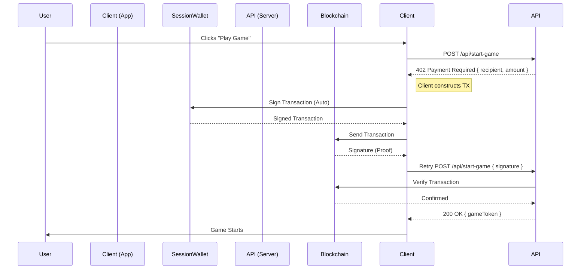

# 🕹️ Arcade.sol


)


> **The Web3 "Quarter Slot" — Seamless Micro-transactions for Gaming.**

**Arcade.sol** reclaims the nostalgia of the physical arcade cabinet using Solana and the HTTP 402 standard. We replace ad-spam and monthly subscriptions with a frictionless **"Pay-Per-Life"** model.

[**Watch the Demo**](https://go.diginomad.xyz/solona-arcade-demo-video) | | [**Live Deployment**](https://arcade-sol.vercel.app/)

---

## 🪙 The Problem & Solution

**The Problem:**
Web gaming monetization is broken.
*   **Ads** ruin the immersion.
*   **Subscriptions** cause fatigue.
*   **Traditional Crypto Payments** require a wallet approval pop-up for every transaction, killing the flow.

**The Solution:**
**Session Wallets + x402 Payments.**
Users deposit a small amount (e.g., 0.1 SOL) into a browser-based "Session Key" once. This key automatically signs micro-transactions ($0.01) in the background, allowing for instant, interrupt-free retries. It's the digital equivalent of keeping a stack of quarters on the cabinet glass.

---

## ✨ Key Features

### 🎮 Seamless "Insert Coin" Experience
*   **Session Wallet:** A burner keypair stored in local storage handles signing.
*   **Zero Interruptions:** No wallet pop-ups during gameplay.
*   **Security:** Users only risk the small amount deposited into the session.

### 💳 x402 Payment Gateway
*   **HTTP 402 (Payment Required):** We implement the standard status code.
*   **Programmatic Access:** The API endpoint `/api/start-game` is gated. It only returns the game token if a valid Solana transaction signature is provided in the headers.

### 🏗️ Creator Economy (Revenue Share)
*   **Platform Model:** Developers submit games to the Arcade.sol registry.
*   **Smart Split:** Every time a user plays, the 90% of the fee goes directly to the Game Developer's wallet, and 10% goes to the Platform.

---

## 🛠️ Architecture

### Tech Stack
*   **Runtime:** [Bun](https://bun.sh) (Fast package manager & runtime)
*   **Framework:** [Next.js 16](https://nextjs.org) (App Router, Server Actions)
*   **Blockchain:** Solana Web3.js & Wallet Adapter
*   **Styling:** TailwindCSS + Lucide React
*   **Visuals:** Canvas API & Retro CSS effects

### The Payment Flow (Sequence)



---

## 🚀 Getting Started

### Prerequisites
*   **Bun** installed (`npm install -g bun`)
*   **Solana Wallet** (Phantom or Solflare) configured for **Devnet**.

### Installation

1.  **Clone the Repo**
    ```bash
    git clone https://github.com/yourusername/arcade-sol.git
    cd arcade-sol
    ```

2.  **Install Dependencies**
    ```bash
    bun install
    ```

3.  **Run Development Server**
    ```bash
    bun dev
    ```

4.  **Open the App**
    Navigate to `http://localhost:3000`

---

## 🕹️ Included Games (MVP)

| Game Title | Description | Cost |
| :--- | :--- | :--- |
| **Floppy Solana** | A clone of the infamous bird game. Dodge green pipes to save your SOL. | 0.0001 SOL |
| **Clicker Challenge** | How fast can you click in 10 seconds? High stakes, high scores. | 0.00005 SOL |

---

## 🛣️ Roadmap

*   [ ] **Mainnet Integration:** Switch from Devnet to Mainnet Beta.
*   [ ] **Leaderboards:** On-chain high score storage.
*   [ ] **NFT Rewards:** Mint an NFT for beating a high score.
*   [ ] **SDK for Devs:** An npm package to make wrapping any React game into Arcade.sol one line of code.

---

## 🏆 Hackathon Tracks
Built for the **Solana Radar Hackathon**.
*   **Consumer App:** A crypto app that people actually want to use.
*   **Payments:** Innovative use of the x402 standard.

---

*Made with ❤️ and ☕ by [Your Name]*
